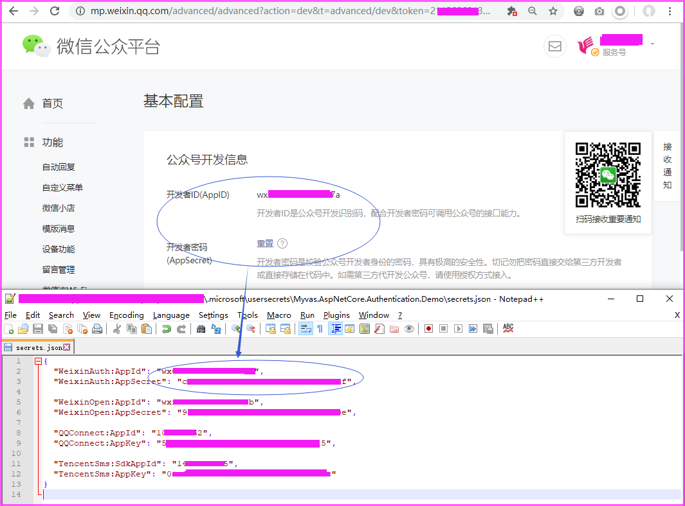
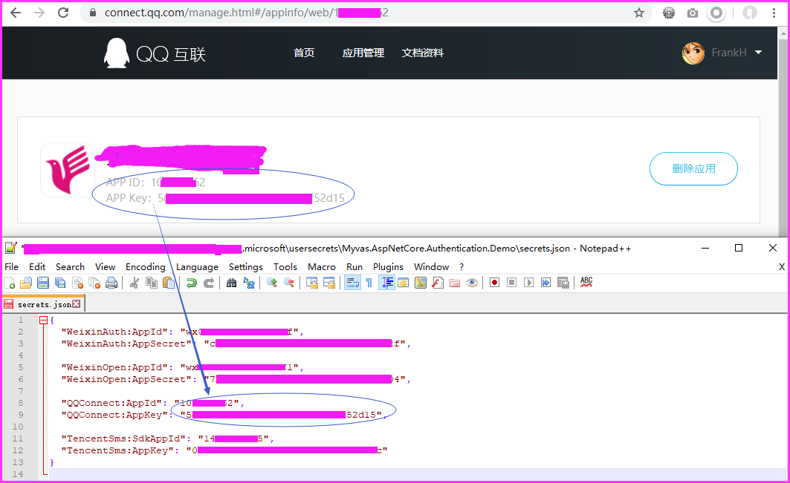

# Myvas.AspNetCore.Authentication.Demo

This repo is auto deployed on <https://demo.auth.myvas.com>
OS: Debian GNU/Linux 11 (bullseye) x86_64

## Components

- Myvas.AspNetCore.Authentication.WeixinAuth
  
  
  
  

- Myvas.AspNetCore.Authentication.WeixinOpen

  
  
  

- Myvas.AspNetCore.Authentication.QQConnect

  
  
  

- Myvas.AspNetCore.TencentSms

  
  

- Myvas.AspNetCore.Email

  
  

- Myvas.AspNetCore.ViewDivert

  
  

- Myvas.AspNetCore.Weixin

  
  

## Qrcode to enter the demo with weixin service account

## Third-party OAuth account settings

### 微信开放平台 WeixinOpen <https://open.weixin.qq.com>

(TODO:在此添加配置说明)

### 微信公众平台 WeixinAuth <https://mp.weixin.qq.com>

（1）微信公众平台-测试账号
/开发/开发者工具/公众平台测试号/...

- 开通功能：网页服务/网页授权获取用户基本信息。
- 设置好授权回调页面域名：例如，demo.auth.myvas.com。

（2）微信公众平台-正式账号
/开发/接口权限/...

- 开通功能：网页服务/网页授权获取用户基本信息。
- 设置好网页授权域名：例如，demo.auth.myvas.com。
- 将文件MP_verify_xxxxxxxxx.txt上传至wwwroot目录下。

### QQ开放平台配置 QQConnect <https://connect.qq.com>

## For developers

- [Visual Studio Code](https://code.visualstudio.com) | [Visual Studio 2022](https://visualstudio.microsoft.com)
- [.NET 8.0](https://dotnet.microsoft.com/download/dotnet-core/8.0)
- [微信开发者工具](https://mp.weixin.qq.com/debug/wxadoc/dev/devtools/download.html)
